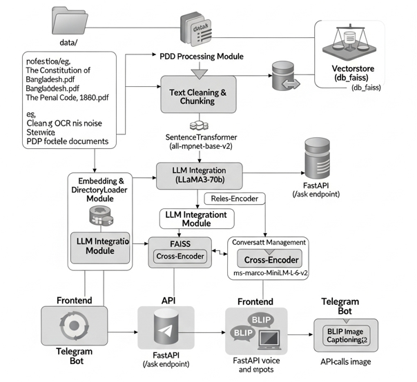
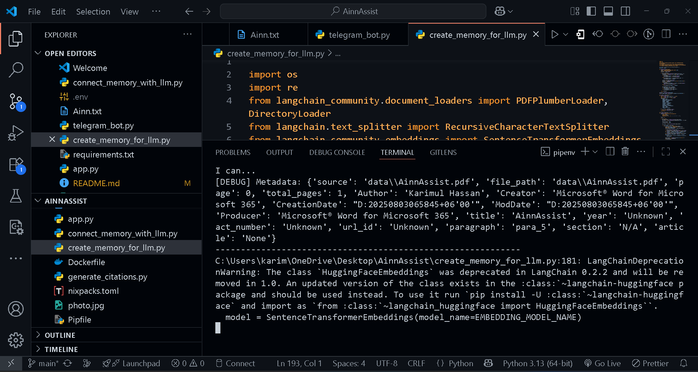
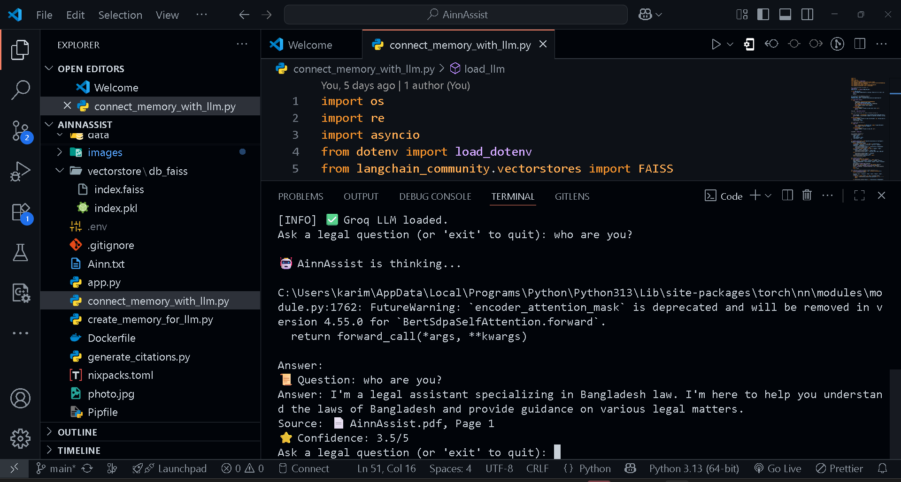
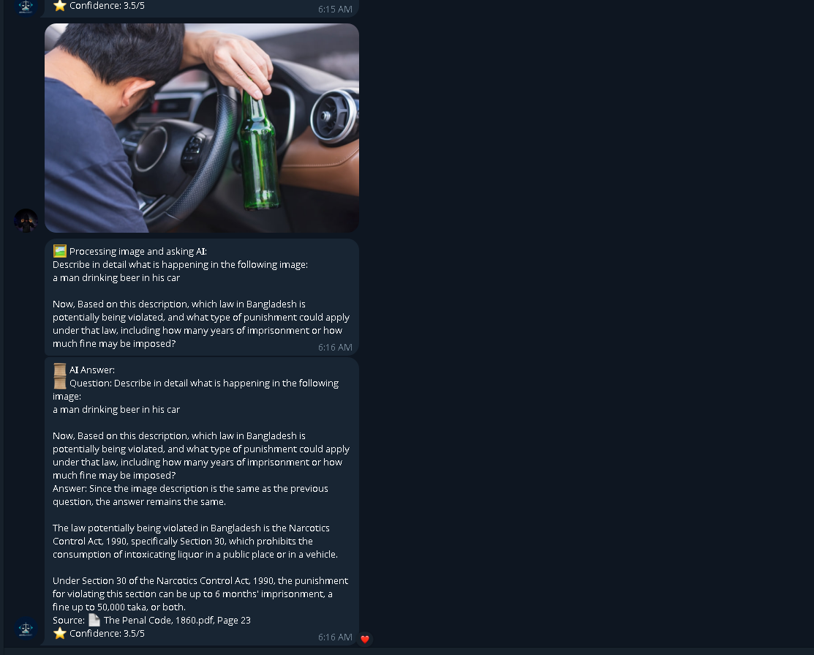

# AinnAssist: Your Legal Assistant for Bangladeshi Law

Bringing Bangladeshi Law Closer to You

## Course Information
- **Course**: CSE299 – Junior Design Project
- **Section**: 2
- **Group**: 5

## Team Members
| Name                  | Student ID   |
|-----------------------|--------------|
| S. M Karimul Hassan   | 2212688642   |
| Susmit Talukder       | 2221865042   |
| Ornab Barua           | 2211905642   |
| Md Shafiq Rahman Nirzon | 2211025042 |

## Supervisor
- **Dr. Shafin Rahman**

## Project Overview

### Overview
AinnAssist is a Telegram-based AI legal assistant designed to provide accurate and accessible information on Bangladeshi laws, including the Constitution, Penal Code, Cyber Law, Labor Law, Anti-Terrorism Act, and more.  
- **Source**: Uses official sources like [bdlaws.minlaw.gov.bd](http://bdlaws.minlaw.gov.bd).
- **Query Support**: Supports Bangla and English queries.
- **Features**: Provides legal guidance via text, voice, and image recognition.

  
*Overview of AinnAssist, showcasing its role as a Telegram-based legal assistant.*

### Core Motivation
To empower students, lawyers, journalists, and citizens in Bangladesh by making legal knowledge more accessible, understandable, and reliable.  
- Simplifies complex laws into clear explanations.
- Provides instant legal assistance through a familiar platform (Telegram).
- Enhances inclusivity with voice support (Bangla & English) and crime detection from images.

  
*Illustration of AinnAssist’s mission to empower users with accessible legal knowledge.*

## Key Features
1. **Embedding and FAISS Vector Store**: Context-aware retrieval for efficient document search.
2. **Automated Citation Generation**: Provides precise citations (document, article/section, page).
3. **Ranking and Scoring with Cross-Encoder**: Enhances retrieval accuracy.
4. **Smart Chunking**: Splits legal documents into manageable, context-aware chunks.
5. **Response Cleaning**: Ensures clean, accurate responses.
6. **Telegram Bot**: Supports text, voice, and image queries.
7. **Multilingual Translation**: Handles Bangla and English queries seamlessly.
8. **Follow-up Query Support**: Maintains conversation context for coherent responses.
9. **Image Captioning with BLIP**: Analyzes images for potential legal violations.
10. **FastAPI Server**: Provides an `/ask` endpoint for query processing.
11. **LLM Integration**: Uses Groq’s LLaMA3-70B for answer generation.
12. **Confidence Scoring**: Assigns reliability scores (0-5) to answers.

  
*Visual representation of AinnAssist’s key features, including Telegram bot and multilingual support.*

## System Architecture
The system integrates multiple components to process legal queries:
- **Input**: Receives queries via Telegram (text, voice, image) or FastAPI endpoint.
- **Processing**: Uses FAISS vector store, Cross-Encoder, and LLaMA3-70B for retrieval and answer generation.
- **Output**: Delivers cited, multilingual responses with confidence scores.

  
*Diagram of AinnAssist’s system architecture, showing Telegram, FastAPI, and LLM integration.*

## Data Processing & Embedding
- **PDF Loading**: Extracts text and metadata (title, year, act number, URL ID) from PDFs (e.g., Constitution, Penal Code) using PDFPlumber, LangChain (DirectoryLoader), and regex.
- **OCR Noise Cleaning**: Removes artifacts (e.g., stray numbers, extra spaces) using regex.
- **Smart Chunking**: Splits documents into 80-character chunks with 40-character overlap using LangChain (RecursiveCharacterTextSplitter) and regex.
- **Embedding Generation**: Converts chunks to embeddings with SentenceTransformers (all-mpnet-base-v2).
- **Vector Store Creation**: Stores embeddings in FAISS for efficient similarity search.
- **Storage Management**: Saves PDFs in `data/` folder and FAISS database in `vectorstore/db_faiss` using `os/pathlib`.

  
*Illustration of the data processing pipeline, from PDF loading to embedding generation.*

## Answer Generation Process
1. **Query Input**: Receives legal queries via Telegram (text, voice, image) or FastAPI using `python-telegram-bot`, FastAPI, and `pydantic`.
2. **Context Update**: Identifies query topic (e.g., Constitution, Penal Code) with keyword matching and regex to update conversation context.
3. **Document Retrieval**: Fetches relevant chunks from FAISS vector store with similarity search, enhanced by Cross-Encoder reranking (ms-marco-MiniLM-L-6-v2).
4. **LLM Processing**: Feeds chunks into Groq’s LLaMA3-70B with custom prompts for accurate answers using LangChain (ChatGroq, ChatPromptTemplate) and `asyncio`.
5. **Confidence Scoring**: Calculates 0-5 score based on similarity, context, query specificity, and metadata using Cross-Encoder and regex.
6. **Response Formatting**: Delivers answers with citations (source, article/section, page) via FastAPI or Telegram, supporting Bangla/English with `langdetect` and `deep_translator`.
7. **Error Handling**: Provides fallback error messages for missing documents or LLM failures using Python and LangChain.

  
*Flowchart of the answer generation process, from query input to cited response.*

## AinnAssist Features

### Ask Legal Questions via Text
- Users send text queries about Bangladeshi laws via Telegram.
- The bot detects language (English/Bangla), translates Bangla to English, and queries a FastAPI endpoint.
- Retrieves PDF chunks from FAISS, processes with LLaMA3-70B, and generates cited answers with confidence scores.
- Responses return in the original language, split if over 4096 chars, with context tracking.

  
*Example of a text query processed by AinnAssist via Telegram.*

### Use Voice Commands
- Users send voice queries via Telegram.
- The bot transcribes audio (English/Bangla) using Google Speech Recognition, translates Bangla to English, and queries a FastAPI endpoint.
- Processes PDF chunks with LLaMA3-70B, generates cited answers with confidence scores, and converts responses to voice (gTTS).
- Responses are split if over 4096 chars, with context tracking.

  
*Illustration of voice query processing and response generation.*

### Submit Images for Legal Analysis
- Users submit images via Telegram to analyze potential legal violations.
- The bot captions images using BLIP, generates legal queries, and queries a FastAPI endpoint.
- Processes PDF chunks with LLaMA3-70B and generates cited answers with confidence scores.
- Responses return in the user’s language, split if over 4096 chars, with context tracking.

  
*Example of image-based legal analysis using BLIP and LLaMA3-70B.*

### Get Multilingual Responses
- Users ask questions in English/Bangla via Telegram.
- The bot detects language with `langdetect`, translates Bangla to English using `GoogleTranslator`, and queries a FastAPI endpoint.
- Processes PDF chunks with LLaMA3-70B and translates answers back, splitting if over 4096 chars.

### Access Cited Answers
- Answers include precise citations (e.g., “Constitution.pdf, Article 5, Page 2”) using metadata from PDFPlumberLoader.
- Prioritizes article/section if specified, splits responses if over 4096 chars, and tracks context.

### Follow Up on Queries
- Users ask follow-up questions (e.g., “Explain more”) via Telegram.
- The bot tracks context using a dictionary (last question, answer, topic) in `connect_memory_for_llm.py`.
- Enriches follow-up queries with prior context, processes with LLaMA3-70B, and delivers cited answers.

### Receive Confidence Scores
- Answers include confidence scores (0-5) calculated in `connect_memory_for_llm.py` using CrossEncoder relevance, context alignment, query specificity, and metadata.
- Scores are clamped between 3.5-5 for relevance and included in responses.

## Evaluation Metrics

### Overview
- **Purpose**: Assess reliability, relevance, and accuracy of answers.
- **Primary Metric**: Confidence Score (3.5–5.0 scale, higher is better).
- **Tools**: Cross-Encoder for reranking, FAISS for vector search.

### Confidence Score Breakdown
- **Formula**:  
  `combined_score = (0.5 × Relevance) + (0.3 × Context Alignment) + (0.1 × Query Specificity) + (0.1 × Metadata Relevance)`  
  Add +0.15 boost for relevant results, clamped to [3.5, 5.0].
- **Components**:
  - **Relevance Score (50%)**: Query-document match using Cross-Encoder (or FAISS fallback), normalized to 0–1 via sigmoid.
  - **Context Alignment Score (30%)**: 1.0 for matching document/topic, 0.8 for known topics, 0.5 otherwise.
  - **Query Specificity Score (10%)**: Based on legal keywords (e.g., “article”, “penal”), starts at 0.5, boosts to 1.0.
  - **Metadata Relevance Score (10%)**: 1.0 if article/section present, extra boost for specific articles.

  
*Breakdown of confidence score calculation and evaluation metrics.*

### Additional Potential Metrics (Not Implemented)
- **Retrieval Precision/Recall**: % of relevant chunks retrieved (e.g., FAISS similarity >0.3).
- **Answer Faithfulness**: How closely the LLM answer aligns with context.
- **Response Time**: Average time for query processing (e.g., <5s for text, <10s for voice/image).
- **User Feedback**: Post-response ratings via Telegram.
- **Transcription/Caption Accuracy**: Word Error Rate (WER) for speech, BLEU for BLIP captions.

### Example Usage
- Evaluate on a test dataset of 1000+ legal queries for real-world benchmarking.
- Note: Scores may be biased toward high values due to clamping.

## Challenges and Solutions
1. **Challenge**: Processing complex legal PDFs with dense text and OCR errors.  
   **Solution**: Used PDFPlumberLoader for text/metadata extraction, cleaned OCR noise with regex, and split into 80-character chunks with 40-character overlap.

2. **Challenge**: Multilingual support for Bangla/English queries.  
   **Solution**: Implemented `langdetect` for language detection and `GoogleTranslator` for seamless translations.

3. **Challenge**: Ensuring accurate and relevant answers.  
   **Solution**: Used FAISS with SentenceTransformerEmbeddings and CrossEncoder for reranking, with context tracking in `connect_memory_for_llm.py`.

4. **Challenge**: Processing voice and image inputs.  
   **Solution**: Used Google Speech Recognition for voice transcription and BLIP for image captioning, integrated with FastAPI.

5. **Challenge**: Providing accurate citations.  
   **Solution**: Extracted metadata during PDF loading and formatted citations in `connect_memory_for_llm.py`.

6. **Challenge**: Calculating reliable confidence scores.  
   **Solution**: Combined relevance, context, specificity, and metadata scores, clamped to 3.5–5.

7. **Challenge**: Handling Telegram’s 4096-character limit.  
   **Solution**: Implemented `send_long_message` in `telegram_bot.py` to split responses.

8. **Challenge**: Supporting follow-up queries.  
   **Solution**: Stored conversation context in a dictionary for coherent responses.

  
*Visual summary of challenges faced and solutions implemented.*

## Future Work
- **WhatsApp Integration**: Allow users to ask legal questions via WhatsApp.
- **Mobile Application**: Develop and publish a mobile app on the Google Play Store.
- **Web Platform**: Create a browser-based platform for wider access.
- **Lawyer Connect System**: Link users with verified advocates for complex queries.

## Installation
To set up AinnAssist locally, follow these steps:

1. **Clone the Repository**:
   ```bash
   git clone https://github.com/your-repo/ainnassist.git
   cd ainnassist
   ```

2. **Install System Dependencies**:
   - **FFmpeg**: Required for audio processing in `telegram_bot.py`.
     - **Windows**: Download FFmpeg from [ffmpeg.org](https://ffmpeg.org/download.html) and add `ffmpeg.exe` and `ffprobe.exe` to your system PATH or specify their paths in the `.env` file.
     - **Linux/macOS**:
       ```bash
       # Ubuntu/Debian
       sudo apt update
       sudo apt install ffmpeg
       # macOS (using Homebrew)
       brew install ffmpeg
       ```

3. **Install Python Dependencies**:
   Ensure you have Python 3.8+ installed. Create a virtual environment (optional but recommended) and install the required packages:
   ```bash
   python -m venv venv
   source venv/bin/activate  # On Windows: venv\Scripts\activate
   pip install --upgrade pip
   pip install -r requirements.txt
   ```
   Create a `requirements.txt` file with the following content:
   ```
   langchain
   langchain-community
   sentence-transformers
   faiss-cpu
   python-telegram-bot
   fastapi
   uvicorn
   pydantic
   speechrecognition
   pydub
   gTTS
   langdetect
   deep-translator
   transformers
   torch
   Pillow
   requests
   python-dotenv
   ```
   Install it with:
   ```bash
   pip install -r requirements.txt
   ```

4. **Set Up Environment Variables**:
   Create a `.env` file in the project root with the following:
   ```
   GROQ_API_KEY=your_groq_api_key
   BOT_TOKEN=your_telegram_bot_token
   API_URL=http://localhost:8000/ask
   FFMPEG_PATH=/path/to/ffmpeg  # e.g., C:\\ffmpeg\\bin\\ffmpeg.exe on Windows
   FFPROBE_PATH=/path/to/ffprobe  # e.g., C:\\ffmpeg\\bin\\ffprobe.exe on Windows
   ```
   - Obtain a `GROQ_API_KEY` from [x.ai/api](https://x.ai/api).
   - Create a Telegram bot via [BotFather](https://t.me/BotFather) to get a `BOT_TOKEN`.
   - Update `FFMPEG_PATH` and `FFPROBE_PATH` based on your FFmpeg installation.

5. **Download Legal PDFs**:
   - Download Bangladeshi legal documents (e.g., Constitution, Penal Code) from [bdlaws.minlaw.gov.bd](http://bdlaws.minlaw.gov.bd).
   - Place them in the `data/` folder in the project root.

6. **Generate FAISS Vector Store**:
   Run the script to process PDFs and create embeddings:
   ```bash
   python create_memory_for_llm.py
   ```
   This creates a FAISS vector store in `vectorstore/db_faiss`.

7. **Run the FastAPI Server**:
   Start the FastAPI server for the `/ask` endpoint:
   ```bash
   uvicorn app:app --host 0.0.0.0 --port 8000
   ```

8. **Run the Telegram Bot**:
   Start the Telegram bot to handle user queries:
   ```bash
   python telegram_bot.py
   ```

## Usage
1. **Text Queries**:
   - Open Telegram and message the AinnAssist bot (e.g., `@AinnAssistBot`).
   - Example: "What does Article 5 of the Constitution say?"
   - Receive a response with citations and a confidence score.

2. **Voice Queries**:
   - Send a voice message to the bot.
   - Example: Record "What is the penalty for theft in the Penal Code?"
   - Receive a voice and text response with citations.

3. **Image Queries**:
   - Upload an image of a potential legal violation.
   - Example: An image of a protest scene.
   - Receive a text response analyzing relevant laws.

4. **FastAPI Endpoint**:
   - Send a POST request to `http://localhost:8000/ask` with JSON payload:
     ```json
     {
       "question": "What is Article 5 of the Constitution?",
       "lang": "en"
     }
     ```
   - Receive a JSON response with answer, citation, and confidence score.

## Contributing
Contributions are welcome! Please follow these steps:
1. Fork the repository.
2. Create a feature branch (`git checkout -b feature/YourFeature`).
3. Commit your changes (`git commit -m 'Add YourFeature'`).
4. Push to the branch (`git push origin feature/YourFeature`).
5. Open a Pull Request.

## License
This project is licensed under the MIT License. See the [LICENSE](LICENSE) file for details.

## Thanks!